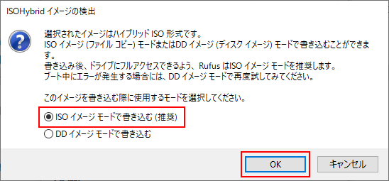
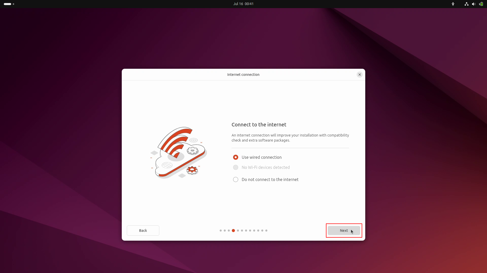
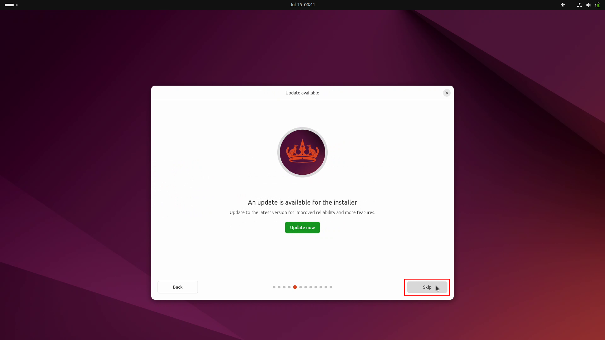

============================================================
Linuxのインストール（PC）
============================================================

Linuxはオープンソースのオペレーティングシステム（OS）です。

PCにはUbuntu Desktop 24.04 LTSをインストールします。

|

Linuxのダウンロード
============================================================

Ubuntu Desktop 24.04 LTSのディスクイメージを `UbuntuのHP <https://releases.ubuntu.com/24.04/>`_ からダウンロードします。

.. image:: ./images/linux_install_pc_img_01.png

|

ダウンロードフォルダに保存されます。

.. image:: ./images/linux_install_pc_img_02.png

|

|

Rufusのダウンロード
============================================================

Rufus（ルーファス）は起動可能なUSBフラッシュドライブを作成することができるソフトウェアです。

Rufusを `RufusのHP <http://rufus.ie/ja/>`_ からダウンロードします。

.. image:: ./images/linux_install_pc_img_03.png

|

下のほうにスクロールしていくと、ダウンロードのリンクがあります。

ここから、Portableをダウンロードしてください。

|

ダウンロードフォルダに保存されます。

.. image:: ./images/linux_install_pc_img_05.png

|

|

Live USBの作成
============================================================

ダウンロードしたRufusをダブルクリックすると、Rufusが起動します。

[いいえ]ボタンをクリック。

.. image:: ./images/linux_install_pc_img_06.png

|

[選択]ボタンをクリック。

.. image:: ./images/linux_install_pc_img_07.png

|

Ubuntuのイメージディスクファイルを選択して、[開く]ボタンをクリック。

.. image:: ./images/linux_install_pc_img_08.png
   :align: center

|

USBメモリを挿入するとデバイスに認識される。

[スタート]ボタンをクリック。

|

「ISOイメージモードで書き込む」が選択されていることを確認して、[OK]ボタンをクリック。

|

[OK]ボタンをクリック。

.. image:: ./images/linux_install_pc_img_11.png
   :align: center

|

インストールメディアの作成中。

|

「準備完了」と表示されたら、[閉じる]ボタンをクリック。

.. image:: ./images/linux_install_pc_img_13.png
   :align: center

|

|

Linuxのインストール
============================================================

Live USBをPCに挿入してください。

PCの電源ボタンを押したら、[F12]キーを連打し、Boot Managerの画面を表示させる。

.. image:: ./images/linux_install_pc_img_14.png
   :align: center

|

[↑]キーと[↓]キーを使って「USB Storagr Device」を選択し、[Enter]キーを押す。

.. image:: ./images/linux_install_pc_img_15.png
   :align: center

|

「Try or Install Ubuntu」が選択されていることを確認し、[Enter]キーを押す。

.. image:: ./images/linux_install_pc_img_16.png
   :align: center

|

しばらく待つ。

.. image:: ./images/linux_install_pc_img_17.png
   :align: center

|

Choose your languageは、「English」が選択されいることを確認し、[Next]ボタンをクリック。

.. image:: ./images/linux_install_pc_img_18.png
   :align: center

|

Accessibility in Ubuntuは、デフォルトのまま[Next]ボタンをクリック。

.. image:: ./images/linux_install_pc_img_19.png
   :align: center

|

Select your keyboard layoutは、「Japanese」-「Japanese」を選択し、[Next]ボタンをクリック。

|

Connect to the internetは、「Use wired connection」を選択し、 [Next]ボタンをクリック。

|

An update is available for the installerは、[Skip]ボタンをクリック。

|

What do you want to do with Ubuntu?は、「Install Ubuntu」を選択し、[Next]ボタンをクリック。

.. image:: ./images/linux_install_pc_img_23.png
   :align: center

|

How would you like to install Ubuntu?は、「Intractive installation」を選択し、[Next]ボタンをクリック。

.. image:: ./images/linux_install_pc_img_24.png
   :align: center

|

What apps would you like to install start with? は、「Default selection」を選択し、[Next]ボタンをクリック。

.. image:: ./images/linux_install_pc_img_25.png
   :align: center

|

Install recommended proprietary software?は、「Install third-party software ...」を選択し、[Next]ボタンをクリック。

.. image:: ./images/linux_install_pc_img_26.png
   :align: center

|

How do you want to install Ubuntu?は、「Erase disc and install Ubuntu」を選択し [Next]ボタンをクリック。

.. image:: ./images/linux_install_pc_img_27.png
   :align: center

|

Create your accountは、次の通り入力し[Next]ボタンをクリック。

- Your name: ubuntu
- Your computer's name: mbc***
- Your username: ubuntu
- Password: hirate2020
- Confirm password: hirate2020
- 「Require my password to login」にチェック

.. image:: ./images/linux_install_pc_img_28.png
   :align: center

|

Select your timezoneは、「Tokyo(Tokyo, Japan)」-「Asia/Tokyo」が選択されいることを確認し、[Next]ボタンをクリック。

|

Review your choicesは、[Install]ボタンをクリック。

.. image:: ./images/linux_install_pc_img_30.png
   :align: center

|

インストールが始まる。

|

インストールが終了すると、 Installation Completeウィンドウが表示されるので[Restart Now]ボタンをクリック。

|

しばらく待つ。

|

「Please remove the installation medium, then press ENTER」というメッセージが表示されるので Live USBを抜いて[Enter]を押す。

.. image:: ./images/linux_install_pc_img_34.png
   :align: center

|

|

Linuxへのログイン
============================================================

ログイン画面が表示されたら、 パスワードを入力してログインしてください。

.. image:: ./images/linux_install_pc_img_01.png
   :width: 800px
   :align: center

|

はじめに、各種設定の画面が表示されますが、 全てデフォルトのままとします。

［Skip］ボタンをクリック。

.. image:: ./images/linux_install_pc_img_01.png
   :align: center

|

［Next］ボタンをクリック。

.. image:: ./images/linux_install_pc_img_01.png
   :align: center

|

［Next］ボタンをクリック。

.. image:: ./images/linux_install_pc_img_01.png
   :align: center

|

［Next］ボタンをクリック。

.. image:: ./images/linux_install_pc_img_01.png
   :align: center

|

［Done］ボタンをクリック。

.. image:: ./images/linux_install_pc_img_01.png
   :align: center

|

Software Updaterが出てきたら、［Install Now］ボタンをクリック。

.. image:: ./images/linux_install_pc_img_01.png
   :align: center

|

アップデート中。

.. image:: ./images/linux_install_pc_img_01.png
   :align: center

|

アップデートが終了したら、［Restart Now］をクリックして再起動する。

.. image:: ./images/linux_install_pc_img_01.png
   :align: center

|

Linuxの日本語化
============================================================

左下のワッフルメニューをクリックして、アプリケーションを表示してください。

［Settings］をクリック。

.. image:: ./images/linux_install_pc_img_01.png
   :width: 800px
   :align: center

|

［Settings］が起動。

.. image:: ./images/linux_install_pc_img_01.png
   :align: center

|

「Region & Language」を選択し、［Manage Installed Languages］をクリック。

.. image:: ./images/linux_install_pc_img_01.png
   :align: center

|

［Install］をクリック。

ここでパスワードの入力を求められるので、パスワードを入力。

.. image:: ./images/linux_install_pc_img_01.png
   :align: center

|

変更の適用中。

.. image:: ./images/linux_install_pc_img_01.png
   :align: center

|

［Language］に日本語（まだグレー）があることを確認し、［Close］をクリック。

.. image:: ./images/linux_install_pc_img_01.png
   :align: center

|

［Language］をクリックする。

.. image:: ./images/linux_install_pc_img_01.png
   :align: center

|

「日本語」を選択して、［Select］をクリック。

.. image:: ./images/linux_install_pc_img_01.png
   :align: center

|

［Restart］をクリックして、再起動。ログアウトするだけなので、再度ログイン。

.. image:: ./images/linux_install_pc_img_01.png
   :align: center

|

再起動すると次のウィンドウが出てきます。

「次回から表示しない」にチェックをして、［古い名前のままにする］をクリック。

.. image:: ./images/linux_install_pc_img_01.png
   :align: center

|

表示が日本語になっていることを確認してください。

日本語と英語の切り替えは、［半角／全角］で行います。