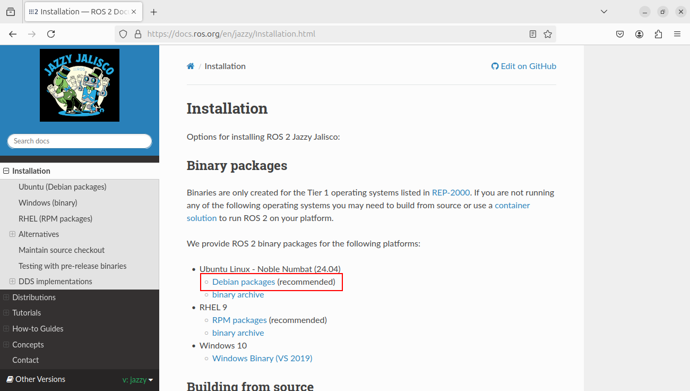

============================================================
ROS2のインストール（PC）
============================================================

PCにROS2をインストールします。

|

ROS2のインストール
============================================================

`ROS2のHP <https://docs.ros.org/en/jazzy/Installation.html>`_ の手順に従ってインストールします。

Binary packagesのDebian packagesを選択してください。

|

ロケールの確認。

.. code-block:: console

    ubuntu@mbc112:~$ locale
    LANG=ja_JP.UTF-8
    LANGUAGE=ja:en
    LC_CTYPE="ja_JP.UTF-8"
    LC_NUMERIC=en_US.UTF-8
    LC_TIME=en_US.UTF-8
    LC_COLLATE="ja_JP.UTF-8"
    LC_MONETARY=en_US.UTF-8
    LC_MESSAGES="ja_JP.UTF-8"
    LC_PAPER=en_US.UTF-8
    LC_NAME=en_US.UTF-8
    LC_ADDRESS=en_US.UTF-8
    LC_TELEPHONE=en_US.UTF-8
    LC_MEASUREMENT=en_US.UTF-8
    LC_IDENTIFICATION=en_US.UTF-8
    LC_ALL=

|

Universeレポジトリを追加。

.. code-block:: console

    ubuntu@mbc112:~$ sudo apt install software-properties-common

.. code-block:: console

    ubuntu@mbc112:~$ sudo add-apt-repository universe

|

ROS 2 GPG(GNU Privacy Guard) keyの追加。

.. code-block:: console

    ubuntu@mbc112:~$ sudo apt update

.. code-block:: console

    ubuntu@mbc112:~$ sudo apt install curl

.. code-block:: console

    ubuntu@mbc112:~$ sudo curl -sSL https://raw.githubusercontent.com/ros/rosdistro/master/ros.key -o /usr/share/keyrings/ros-archive-keyring.gpg

|

レポジトリ情報をsource listに追加。

.. code-block:: console

    ubuntu@mbc112:~$ echo "deb [arch=$(dpkg --print-architecture) signed-by=/usr/share/keyrings/ros-archive-keyring.gpg] http://packages.ros.org/ros2/ubuntu $(. /etc/os-release && echo $UBUNTU_CODENAME) main" | sudo tee /etc/apt/sources.list.d/ros2.list > /dev/null

|

ROS2のインストール。

.. code-block:: console

    ubuntu@mbc112:~$ sudo apt update

.. code-block:: console

    ubuntu@mbc112:~$ sudo apt upgrade

.. code-block:: console

    ubuntu@mbc112:~$ sudo apt install ros-jazzy-desktop

.. note::

   PCにはGUIツールやデモが含まれるDesktopをインストールします。

|

サンプルプログラムの実行
============================================================

インストールが正しく行われたか確認するために、サンプルプログラムを実行します。

.. code-block:: console

    ubuntu@mbc112:~$ source /opt/ros/iron/setup.bash

.. code-block:: console

    ubuntu@mbc112:~$ ros2 run demo_nodes_cpp talker
    [INFO] [1721350073.408466518] [talker]: Publishing: 'Hello World: 1'
    [INFO] [1721350074.408408710] [talker]: Publishing: 'Hello World: 2'
    [INFO] [1721350075.408425046] [talker]: Publishing: 'Hello World: 3'
    [INFO] [1721350076.408476132] [talker]: Publishing: 'Hello World: 4'
    [INFO] [1721350077.408549328] [talker]: Publishing: 'Hello World: 5'
    [INFO] [1721350078.408493898] [talker]: Publishing: 'Hello World: 6'
    [INFO] [1721350079.408489643] [talker]: Publishing: 'Hello World: 7'
    [INFO] [1721350080.408474518] [talker]: Publishing: 'Hello World: 8'
    [INFO] [1721350081.408475482] [talker]: Publishing: 'Hello World: 9'
    [INFO] [1721350082.408486524] [talker]: Publishing: 'Hello World: 10'
    ・・・

|

新しい端末を開いて、次のコマンドを実行してください。

.. code-block:: console

    ubuntu@mbc112:~$ source /opt/ros/iron/setup.bash

.. code-block:: console

    ubuntu@mbc112:~$ ros2 run demo_nodes_py listener
    [INFO] [1721350073.434122118] [listener]: I heard: [Hello World: 1]
    [INFO] [1721350074.409888251] [listener]: I heard: [Hello World: 2]
    [INFO] [1721350075.410019382] [listener]: I heard: [Hello World: 3]
    [INFO] [1721350076.411280867] [listener]: I heard: [Hello World: 4]
    [INFO] [1721350077.410643558] [listener]: I heard: [Hello World: 5]
    [INFO] [1721350078.410895054] [listener]: I heard: [Hello World: 6]
    [INFO] [1721350079.411915994] [listener]: I heard: [Hello World: 7]
    [INFO] [1721350080.411029085] [listener]: I heard: [Hello World: 8]
    [INFO] [1721350081.410888225] [listener]: I heard: [Hello World: 9]
    [INFO] [1721350082.411981922] [listener]: I heard: [Hello World: 10]
    ・・・

|

Terminalを起動するたびにsetup fileを実行するのは面倒なので、shellのstartup scriptに書いておきます。

.. code-block:: console

    ubuntu@mbc112:~$ echo "source /opt/ros/jazzy/setup.bash" >> ~/.bashrc

|

ROS_DOMAIN_IDの設定
============================================================

ROS2はネットワーク上のnodeを自動的に発見します。そのため、同一ネットワークであれば複数のPCでnodeを実行させて分散処理することが簡単にできます。

一方で、複数人が同一ネットワーク上でnodeを実行すると、どのnodeから送られてきたデータか分からなくなることがあります。

そのため、ROS2ではROS_DOMAIN_IDを設定することでこの問題を回避します。ROS_DOMAIN_IDに数値を設定すると、同じ値が設定されたTerminal間でしかnodeが見られなくなります。

次のコマンドを実行してROS_DOMAIN_IDを設定してください。IDはZumoの番号と同じにします。Zumo-01を使っている場合は1とします。

.. code-block:: console

    ubuntu@mbc112:~$ export ROS_DOMAIN_ID=1

|

Terminalを起動するたびにIDを設定するのは面倒なので、shellのstartup scriptに書いておきます。

.. code-block:: console

    ubuntu@mbc112:~$ echo "export ROS_DOMAIN_ID=1" >> ~/.bashrc
