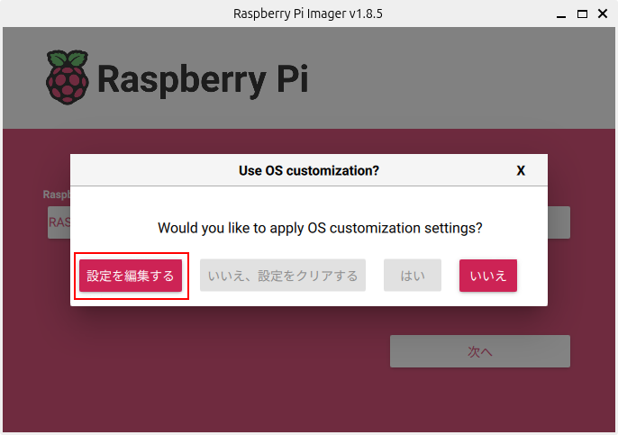
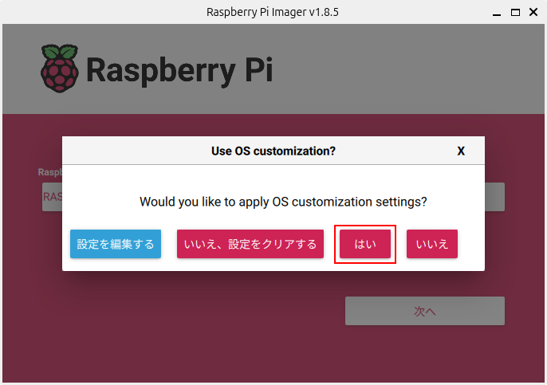

============================================================
Linuxのインストール（Raspberry Pi）
============================================================

Linuxはオープンソースのオペレーティングシステム（OS）です。

Raspberry PiではUbuntu Server 24.04 LTSを使います。

Raspberry Pi Imagerのインストール
============================================================

公式のディスクイメージ書き込みツールRaspberry Pi Imagerを使ってSDカードにディスクイメージを書き込みます。

詳しくは、 `Raspberry Pi OSのHP <https://www.raspberrypi.com/software/>`_ を参照してください。

以下のコマンドを実行してRaspberry Pi Imagerをインストール。

.. code-block:: console

    ubuntu@mbc084:~$ sudo apt install rpi-imager

ディスクイメージの書き込み
============================================================

Raspberry Pi Imagerを起動。

[デバイスを選択]ボタンをクリック。

.. image:: ./images/linux_install_pi_img_01.png

「Raspberry Pi 5」を選択。

[OSを選択]ボタンをクリック。

.. image:: ./images/linux_install_pi_img_03.png

「Other general-purpose OS」を選択。

.. image:: ./images/linux_install_pi_img_04.png

「Ubuntu」を選択。

.. image:: ./images/linux_install_pi_img_05.png

［Ubuntu Server 24.04.2 LTS (64bit)］を選択。

SDカードを挿入して、[ストレージを選択]ボタンをクリック。

挿入したSDカードを選択。

[次へ]ボタンをクリック。

.. image:: ./images/linux_install_pi_img_09.png

[設定を編集する]ボタンをクリック。

次の通り入力し[保存]ボタンをクリック。

- 「ホスト名」にチェック
- ホスト名：zumo01.local
- 「ユーザー名とパスワードを設定する」にチェック
- ユーザー名：pi
- パスワード：hirate2020
- 「ロケールを設定する」にチェック
- タイムゾーン：Asia/Tokyo
- キーボードレイアウト：jp

[はい]ボタンをクリック。

[はい]ボタンをクリック。

.. image:: ./images/linux_install_pi_img_13.png

書き込み中。

［続ける］ボタンをクリック。

Raspberry Pi Imagerを終了し、SDカードをUnmountして取り出す。

Linuxへのログイン
============================================================

Raspberry Piにモニター、キーボード、LANケーブルを接続してください。

SDカードを挿入して電源を入れます。

しばらくすると次のような場面が表示されます。

.. code-block:: console

    Ubuntu 24.04 LTS zumo01 tty1

    zumo01 login: pi
    Password: hirate2020

ユーザー名にpi、パスワードにhirate2020を入力してログイン。

※パスワードは表示されません

.. code-block:: console

    Welcome to Ubuntu 24.04 LTS (GNU/Linux 6.8.0-1004-raspi aarch64)
    ・・・
    pi@zumo01:~$
