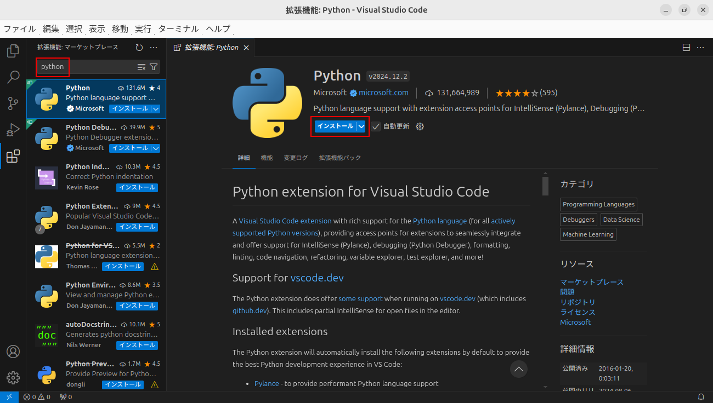
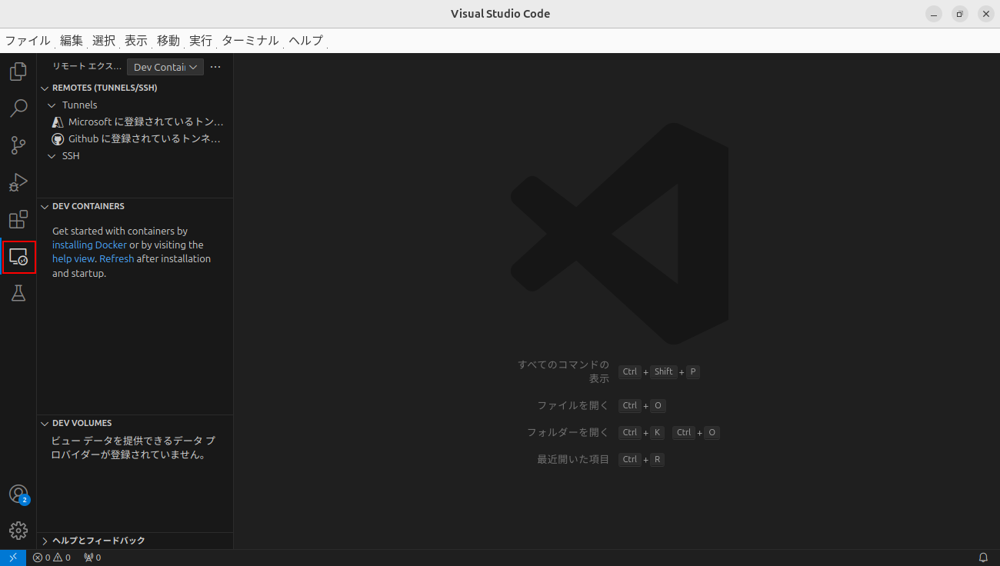
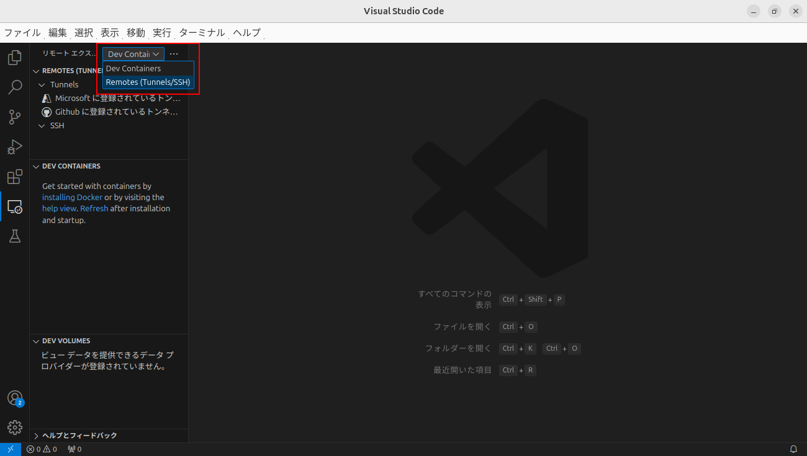
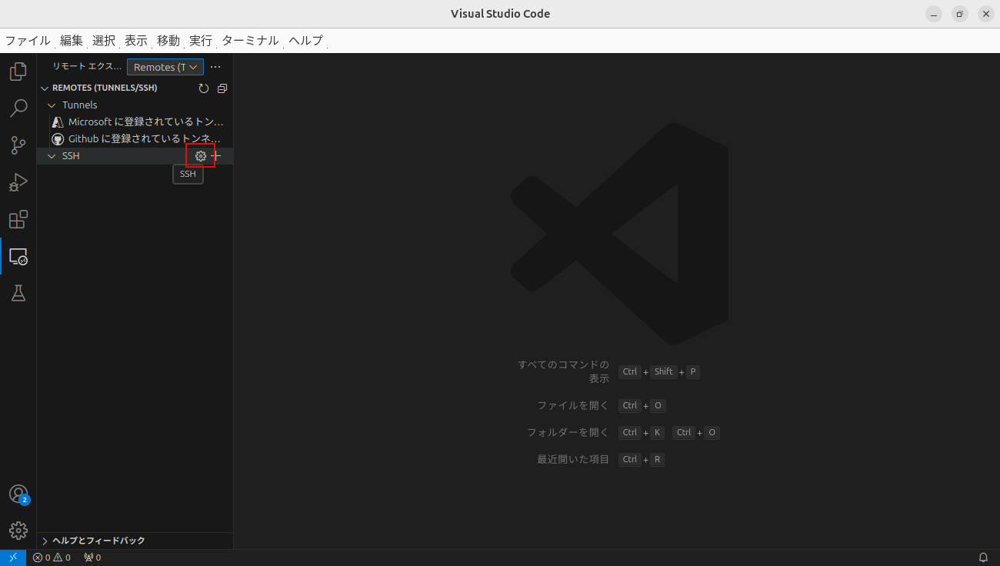

============================================================
VSCode
============================================================

`【Linux】Ubuntu22.04 LTSにVisual Studio Codeをインストール <https://it-dxblog.com/ubuntu22-vscode/>`_ を参考にしました。

Visual Studio Code（VSCode）は、Microsoft社が提供する定番の開発用エディタです。
ここまでnanoエディタを使ってきましたが、WindowsやMacに慣れた人には使いにくと思いますので、
VSCodeで開発できるよう環境を構築します。

|

VSCodeのインストール
============================================================

`公式HP <https://code.visualstudio.com/>`_ の手順に従ってインストールします。

[.deb Debian, Ubuntu...]と書かれたリンクをクリック。 ファイルはDownloadsディレクトリに保存される。

.. image:: ./images/vscode_img_01.png

Downloadsディレクトリへ移動。

.. code-block:: console

    ubuntu@mbc112:~$ cd Downloads/

ダウンロードしたファイルを確認。

.. code-block:: console

    ubuntu@mbc112:~/Downloads$ ls
    code_1.92.0-1722473020_amd64.deb

VSCodeをインストール。

.. code-block:: console

    ubuntu@mbc112:~/Downloads$ sudo apt install ./code_1.92.0-1722473020_amd64.deb

VSCodeを起動。

|

拡張機能のインストール
============================================================

次の拡張機能をインストールします。

- Japanese Language Pack for Visual Studio Code（日本語化）
- Python
- Remote Development（ssh接続）

|

左側のタブから拡張機能を選択、japanで検索してJapanese Language Pack for Visual Studio Codeをインストール。

VSCodeを再起動。

再起動後、日本語表示になる。

pythonで検索してPythonをインストール。

remoteで検索してRemote Developmentをインストール。

.. image:: ./images/vscode_img_07.png

|

鍵の設定
============================================================

公開鍵と秘密鍵のペアを作成。

.. code-block:: console

    ubuntu@mbc112:~$ ssh-keygen -t rsa
    Generating public/private rsa key pair.
    Enter file in which to save the key (/home/ubuntu/.ssh/id_rsa): 
    Enter passphrase (empty for no passphrase): 
    Enter same passphrase again: 
    Your identification has been saved in /home/ubuntu/.ssh/id_rsa
    Your public key has been saved in /home/ubuntu/.ssh/id_rsa.pub
    The key fingerprint is:
    SHA256:1BucBuftMB0sm6bLahuOhof1/yCR2ldQo24oDnNZm8A ubuntu@mbc112
    The key's randomart image is:
    +---[RSA 3072]----+
    |        . +..    |
    |   .     O.=..   |
    |    E . + X+o    |
    |     + B o+*     |
    |  o + * Soo .    |
    |   =.+ o..       |
    |   +o.+.o.       |
    |  o ooo+o.       |
    |   o..++...      |
    +----[SHA256]-----+

id_rsaとid_rsa.pub（鍵のペア）が作成された。

.. code-block:: console

    ubuntu@mbc112:~$ ls .ssh
    authorized_keys  id_rsa  id_rsa.pub

d_rsa.pubをRaspberry Piにコピー。

.. code-block:: console

    ubuntu@mbc112:~$ scp .ssh/id_rsa.pub pi@192.168.1.241:
    The authenticity of host '192.168.1.241 (192.168.1.241)' can't be established.
    ED25519 key fingerprint is SHA256:P58ZZjn4tjnmRVCyFi1gGV5MHmTtZQzfwCyUaSr460g.
    This key is not known by any other names.
    Are you sure you want to continue connecting (yes/no/[fingerprint])? yes
    Warning: Permanently added '192.168.1.241' (ED25519) to the list of known hosts.
    pi@192.168.1.241's password: 
    id_rsa.pub                                    100%  567   170.3KB/s   00:00    

コピーしたid_rsa.pubはRaspberry Piのホームディレクトリにある。

.. code-block:: console

    pi@zumo01:~$ ls
    Arduino  Python  bin  id_rsa.pub  ros2_ws  zm_test

これを「.ssh」ディレクトリの中に「authrized_keys」という名前で保存。

.. code-block:: console

    pi@zumo01:~$ cat id_rsa.pub >> .ssh/authorized_keys 

.sshディレクトリの権限を変更。

.. code-block:: console

    pi@zumo01:~$ chmod 700 .ssh

.ssh/authorized_keysの権限を変更。

.. code-block:: console

    pi@zumo01:~$ chmod 600 .ssh/authorized_keys 

id_rsa.pubを削除。

.. code-block:: console

    pi@zumo01:~$ rm id_rsa.pub 

sshd_configファイルを開く。

.. code-block:: console

    pi@zumo01:~$ sudo nano /etc/ssh/sshd_config

#（コメント）を外して次のように設定。 ( )は行数を表す。

.. code-block:: console

    (14)Port 22
    (33)PermitRootLogin no
    (37)RSAAuthentication yes
    (38)PubkeyAuthentication yes
    (41)AuthorizedKeysFile .ssh/authorized_keys
    (57)PasswordAuthentication no

SSHサーバを再起動。

.. code-block:: console

    pi@zumo01:~$ sudo /etc/init.d/ssh restart
    Restarting ssh (via systemctl): ssh.service.

これで、パスワード認証は無効、鍵ファイルで接続できるようになった。

鍵ファイルで接続できるかテスト。

.. code-block:: console

    ubuntu@mbc112:~$ ssh -i .ssh/id_rsa -p 22 pi@192.168.1.241
    Welcome to Ubuntu 24.04 LTS (GNU/Linux 6.8.0-1008-raspi aarch64)

    * Documentation:  https://help.ubuntu.com
    * Management:     https://landscape.canonical.com
    * Support:        https://ubuntu.com/pro

    System information as of Tue Aug  6 15:36:35 JST 2024

    System load:  0.0                Temperature:            59.5 C
    Usage of /:   16.3% of 28.51GB   Processes:              144
    Memory usage: 2%                 Users logged in:        1
    Swap usage:   0%                 IPv4 address for wlan0: 192.168.1.241

    * Strictly confined Kubernetes makes edge and IoT secure. Learn how MicroK8s
    just raised the bar for easy, resilient and secure K8s cluster deployment.

    https://ubuntu.com/engage/secure-kubernetes-at-the-edge

    Expanded Security Maintenance for Applications is not enabled.

    60 updates can be applied immediately.
    To see these additional updates run: apt list --upgradable

    11 additional security updates can be applied with ESM Apps.
    Learn more about enabling ESM Apps service at https://ubuntu.com/esm

    Last login: Tue Aug  6 15:17:14 2024 from 192.168.1.26

|

SSH接続
============================================================

左側のタブからリモートエクスプローラを選択。

Remotes(Tunnels/SSH)を選択。

SSHの右側にある歯車をクリック。

/home/ubuntu/.ssh/configを選択。

configファイルが表示される。

編集。

.. code-block:: text

    Host Zumo
        HostName 192.168.1.250
        User pi
        Port 22
        IdentityFile ~/.ssh/id_rsa

.. image:: ./images/vscode_img_14.png

更新する。

.. image:: ./images/vscode_img_15.png

Zumoが表示される。

Zumoの右側にある矢印をクリック。

.. image:: ./images/vscode_img_17.png

Raspberry Piと接続された。

「フォルダー開く」をクリックして、home/pi/を選択。

「はい、作成者を信頼します」をクリック。

.. image:: ./images/vscode_img_20.png

Raspberry Piのディレクトリやファイルが見られるようになった。

