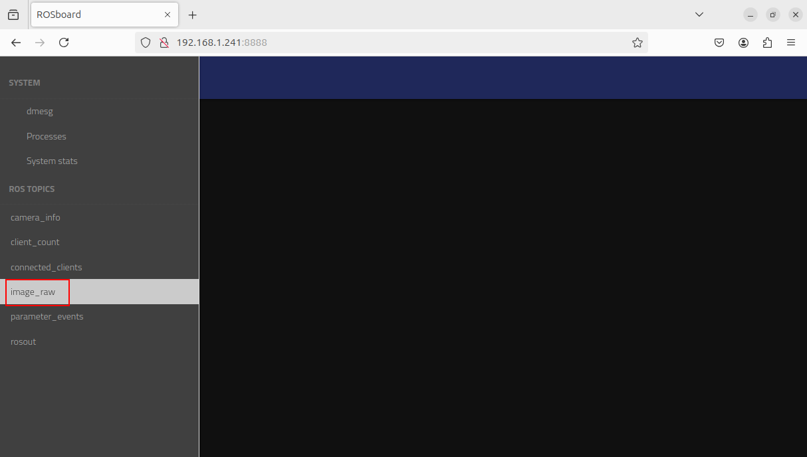

============================================================
rosbridge
============================================================

`ROS2でrosbridge_suiteを使ってみた <https://zenn.dev/botamochi6277/articles/a3d618978b31f2>`_ を参考にしました。

rosbridge（ROSのノードをWebSocket通信を介してデータのやり取りを行うもの）とrosboard（Rosの可視化ツール）
を使って、Raspberry Piに接続したWebカメラの映像を見られるようにします。

|

rosbridgeのインストール
============================================================

パッケージのアップデート。

.. code-block:: console

    pi@zumo01:~$ sudo apt update

rosbridgeのインストール。

.. code-block:: console

    pi@zumo01:~$ sudo apt install ros-jazzy-rosbridge-suite

rosbridgeを起動。

.. code-block:: console

    pi@zumo01:~$ ros2 launch rosbridge_server rosbridge_websocket_launch.xml
    [INFO] [launch]: All log files can be found below /home/pi/.ros/log/2024-08-07-12-58-01-245333-zumo01-3147
    [INFO] [launch]: Default logging verbosity is set to INFO
    [INFO] [rosbridge_websocket-1]: process started with pid [3161]
    [INFO] [rosapi_node-2]: process started with pid [3162]
    [rosbridge_websocket-1] [INFO] [1723003083.938370147] [rosbridge_websocket]: Rosbridge WebSocket server started on port 9090

rosboardに必要なパッケージをインストール。

.. code-block:: console

    pi@zumo01:~$ sudo pip3 install --break-system-packages tornado simplejpeg

ワークスペースのsrcディレクトリへ移動。

.. code-block:: console

    pi@zumo01:~$ cd ros2_ws/src/

rosboardをgitからダウンロード。

.. code-block:: console

    pi@zumo01:~/ros2_ws/src$ git clone https://github.com/dheera/rosboard

ワークスペースへ移動。

.. code-block:: console

    pi@zumo01:~/ros2_ws/src$ cd ..

セットアップファイルを反映。

.. code-block:: console

    pi@zumo01:~/ros2_ws$ source install/local_setup.bash

rosboardを起動。

.. code-block:: console

    pi@zumo01:~/ros2_ws$ ./src/rosboard/run
    /opt/ros/jazzy/lib/python3.12/site-packages/rclpy/qos_event.py:19: UserWarning: importing 'qos_event' is deprecated; import 'event_handler' instead
    warnings.warn("importing 'qos_event' is deprecated; import 'event_handler' instead")
    Running from ['/home/pi/ros2_ws/src/rosboard/rosboard']
    [INFO] [1723003561.294517609] [rosboard_node]: ROSboard listening on :8888

PCのブラウザでhttp://192.168.1.241:8888にアクセスするとrosboardが表示される。

.. image:: ./images/rosbridge_img_01.png

カメラの映像を確認
============================================================

rosbridgeを起動。

.. code-block:: console

    ros2 launch rosbridge_server rosbridge_websocket_launch.xml

rosboardを起動。

.. code-block:: console

    pi@zumo01:~/ros2_ws$ ./src/rosboard/run

v4l2_camera_nodeを実行。

.. code-block:: console

    pi@zumo01:~/ros2_ws$ ros2 run v4l2_camera v4l2_camera_node

左上のバーガーメニューから「image-raw」を選択。

カメラの映像が表示される。

